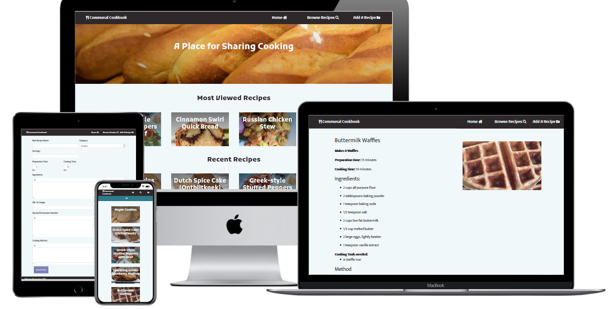

# Communal Cookbook

The project's purpose is to act as a digital recipe book, for the useage of a relatively small user-base and I to share recipes in an easily accesible and readable format.
This is to act as an alternative to clumsily sharing photos of the recipes or links to other sites that may not be accessible in different countries, or may be difficult to use from a variety of devices.
 
## Demo

A live version of this site is available [here](https://dcd-milestone-recipe-site.herokuapp.com/)

## UX

### Strategy

The aim of this project is to create a web app for an online communal cookbook for the purpose of sharing and updating recipes; with a clean and immediately readable design to better facilitate it's use during cooking while following the recipes; An easy to use recipe creation and editing interface; And a searchable and well designed database.

The first thing to tackle was researching how similar sites lay out their content and divide their recipes into categories. Using the information gleaned from this research stage, the wireframes were created following some of the design trends from these sites, along with my own personal tastes, as the site will most likely continue to be used by me and my friends and associates to share recipes.

After this, a database had to be designed and created to ensure the recipes could be stored in a sensible and efficient manner. To do this, the vital information for each recipe was decided upon, and then following that a template document was created on the MongoDB database.

### Scope

The minimum viable product for this project involves: A homepage for a recipe site, a browse page with selectable categories and a search function, a recipe creation/update/delete page that properly updates the databse and is simple to use, and a page to display the selected recipe. This will be achieved through the use of Flask templates and python calls of the database. In addition, the site must feature CSS styling appropriate to the content, and javascript to further enhance the resposiveness of the site.

### Structure

The site will make use of templates, as is appropriate for a flask app, in order to ensure common elements accross pages do not need to be recreated multiple times, nor edited repeatedly for a single change. This will be further extended to include flask for loops to ease construction of elements of a page, such as the individual recipes being displayed during a search.

The database is a document-based system, as this is what MongoDB provides, along with making the most sense for the chosen content, as each recipe would be stored as what amounts to a document anyway.

### Skeleton

#### Home Page

##### Recipe List Page

#### Recipe Create/Edit Page

#### Recipe Page

#### Database Diagram

### Surface

The colour palette for this project needs to be both clean and immediately readable, so contrasting colours will need to be utilised, but the colourscheme should be cohesive so as to not draw attention away from important regions of the page.

as such, this palette was chosen:

This clean and readable design should extend to the general design of the elements of the page.

#### User Stories & Breakdown Thereof

 - As a User, I want to be able to view a recipe and follow it to recreate the dish:
    - Find a select a recipe
    - Be taken to the recipe's page
    - Be able to see the ingredients needed for the recipe
    - Be able to easily read the methodology for the dish

 - As a User, I want to be able to search for a specific recipe on the site:
    - Be able to sort recipes by category
    - Be able to search for a recipe by a term or word
        - Be able to search in dish name or ingredients

 - As a User, I want to be able to add my own recipes to the site:
    - Click a button to be taken to a recipe creation page
    - Have clear and readable fields to enter the appropriate information
    - Be taken to the created recipe page after submitting the data

 - As a User, I want to be able to edit or delete existing recipes:
    - Click on a button on a recipe's page to be taken to an edit page
        - Essentially the recipe addition page, but with information already filled
            - (Would need to reference the recipe ID in the page somehow to ensure the edit works)
        - Altering information on this page and submitting should alter the information in the database.
    - Click on a delete button on a recipe's page to remove it entirely.
        - A conformation message should be used to prevent accidental deletions.

## Features

The site consists of a digital recipe book, allowing users to view a variety of recipes via their browser. 
The homepage features a short listing of the most viewed recipes and the most recently added ones, allowing users to stay up to date and provide them tantalising meal ideas. The search
page allows users to find a particular recipe by its name, or to filter recipes by a desired meal category. The edit page allows users to alter the recipes, or add their own and ensure that these changes are saved.
The delete button allows for the removal of recipes by users.
Finally, the Recipe page allows users to view the recipe in a clean and clear manner, to make it easier to follow when cooking.

## Technologies Used

- [TinyMCE](https://www.tiny.cloud/)
- [Bootstrap](https://getbootstrap.com/)
    - [JQuery](https://jquery.com/)
- [Flask](https://flask.palletsprojects.com/en/1.1.x/)
- [MongoDB](https://www.mongodb.com/cloud/atlas)
- [Google Fonts](https://fonts.google.com/)
- [pyMongo](https://pymongo.readthedocs.io/en/stable/)
- [Requests HTTP library](https://requests.readthedocs.io/en/master/)
- [FontAwesome](https://fontawesome.com/)
- [Pillow](https://pillow.readthedocs.io/en/stable/)

### Code Validation

#### Python
[ExtendsClass](https://extendsclass.com/python-tester.html)
 - No syntax errors.

#### Javascript
[BeautifyTools](http://beautifytools.com/javascript-validator.php) 
 - "tinymce not defined"
    - just due to how tinymce is intialised, is defined in the tinymce js files.
 - functions defined but never used
    - functions are used, but not in the js file.
[JSHint](https://jshint.com/)
 - as above, but also "$ undefined"
    - This one doesn't recognise Jquery.

Otherwise, no issues.

#### HTML
Due to the abundance of Jinja used, I was unable to find a compatible verifier.

#### CSS
[W3C CSS Validation Service](https://jigsaw.w3.org/css-validator/)
 - No issues.

## Testing

Testing was primarily manual, as I wasn't entirely sure how to go about automating adding and removing elements of the database to ensure it worked fully, 
so I did this by hand by populating the database with a selection of test recipes.

### User Story Testing

- Users can view a recipe by clicking/tapping the thumbnail to be taken to its page, where the methodology and ingredients are clearly visible.

- Both categorical searches and name-based searches are functional, and presented in a method that does not overload the user with information.

- Recipes can be added by clicking on the "add a recipe" button, taking the user to a creation page that provides a clear and easy to both read and use form to enter the recipe's data.
    - Users are taken to the recipe's page after clicking submit on their recipe.

- Recipes can be both edited and deleted using the controls on their pages.
    - Clicking edit will take the user to the recipe creation page, but with the forms already filled with the recipe's data.
    - The delete button removes the recipe.

### Interesting Bugs & Known Issues

During the course of development, I came across a couple of somewhat persistant issues that took a great deal of looking and figuring to solve.

First amoung these was an issue with fullscreen objects, such as the navbar and footer. The nature of this issue was that despite having 100% width, they would not fill the width of the screen, other similar methods
did naught to alliviate this issue, until I found that specifically setting the left margin to 0px fixed it.

Next, was an issue that caused strange error messages in python, mainly that values were being set to a variable that had no interaction that I could see with where the aforementioned values were set. I'm still not entirely sure how this one stopped happening.

Lastly, a bug that continues to hound me is one that might be with the way chrome's debug suite handles resizing the responsive mode viewport, as on occasion the page's content will be floated past the edge of the screen. This happens incredibly inconsistently, making testing difficult.

## Deployment

Deployment was thankfully an easy affair, It primarily involved setting up a Heroku app. While most of the work is done for you with Heroku, 
I did have to set up several environment variables in order to guarentee the safety of the API key and login details for MongoDB. 
Additionally IP and PORT keys were set up, to allow for a similarly safe connection.

Some minor changes were made to python and javascript code during this process, entirely removing debug messages and personal reminder comments.

There was a slight issue with a missing python module, but manually adding it to the requirements.txt seemingly fixed it.

## Credits

### Content

- [Basic setup for the select form element with jinja](https://stackoverflow.com/questions/29451208/set-default-value-for-select-html-element-in-jinja-template)
- https://stackoverflow.com/questions/12020657/how-do-i-open-an-image-from-the-internet-in-pil/12020860

### Media

- [Home Page Baguettes](https://pixabay.com/photos/bread-baguettes-food-3803633/)

#### Recipes:

Links lead to original postings

[Maple Cookies](https://www.allrecipes.com/recipe/9773/maple-cookies/)
[Dutch Spice Cake](https://www.cdkitchen.com/recipes/recs/29/Dutch_Spice_Cake_Ontbijtkoek18154.shtml)
[Greek-style Stuffed Peppers with Beef](https://realfood.tesco.com/recipes/greek-style-stuffed-peppers-with-beef.html)
[Jumbo Sparkling Blueberry Muffins](https://sallysbakingaddiction.com/sparkling-jumbo-blueberry-muffins-2/)
[Buttermilk Waffles](https://www.allrecipes.com/recipe/233920/tender-and-easy-buttermilk-waffles/)
[Cinnamon Swirl Quick Bread](https://sallysbakingaddiction.com/cinnamon-swirl-quick-bread/)
[Russian Chicken Stew](https://www.allrecipes.com/recipe/261231/russian-chicken-stew-with-potatoes-and-vegetables/)
[Mushroom Risotto](https://www.allrecipes.com/recipe/231713/chef-johns-baked-mushroom-risotto/)
[Potica](https://www.allrecipes.com/recipe/17236/potica/)

### Acknowledgements

Both my Mentor and the Support Team for being patient with me as I dealt with issues both within and outside this project.