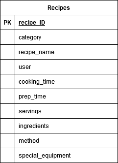

# Communal Cookbook

The project's purpose is to act as a digital recipe book, for the useage of a relatively small user-base and I to share recipes in an easily accesible and readable format.
This is to act as an alternative to clumsily sharing photos of the recipes or links to other sites that may not be accessible in different countries, or may be difficult to use from a variety of devices.
 
## Demo

## UX

### Strategy

The aim of this project is to create a web app for an online communal cookbook for the purpose of sharing and updating recipes; with a clean and immediately readable design to better facilitate it's use during cooking while following the recipes; An easy to use recipe creation and editing interface; And a searchable and well designed database.

The first thing to tackle was researching how similar sites lay out their content and divide their recipes into categories. Using the information gleaned from this research stage, the wireframes were created following some of the design trends from these sites, along with my own personal tastes, as the site will most likely continue to be used by me and my friends and associates to share recipes.

After this, a database had to be designed and created to ensure the recipes could be stored in a sensible and efficient manner. To do this, the vital information for each recipe was decided upon, and then following that a template document was created on the MongoDB database.

### Scope

The minimum viable product for this project involves: A homepage for a recipe site, a browse page with selectable categories and a search function, a recipe creation/update/delete page that properly updates the databse and is simple to use, and a page to display the selected recipe. This will be achieved through the use of Flask templates and python calls of the database. In addition, the site must feature CSS styling appropriate to the content, and javascript to further enhance the resposiveness of the site.

### Structure

The site will make use of templates, as is appropriate for a flask app, in order to ensure common elements accross pages do not need to be recreated multiple times, nor edited repeatedly for a single change. This will be further extended to include flask for loops to ease construction of elements of a page, such as the individual recipes being displayed during a search.

The database is a document-based system, as this is what MongoDB provides, along with making the most sense for the chosen content, as each recipe would be stored as what amounts to a document anyway.

### Skeleton

#### Home Page

##### Recipe List Page

#### Recipe Create/Edit Page

#### Recipe Page

#### Database Diagram

### Surface

[colour palette and design considerations (eg, templates, design methodology) goes here]

#### User Stories & Breakdown Thereof

## Features

## Technologies Used

## Testing

### Code Validation

### User Story Testing

### Interesting Bugs & Known Issues

## Deployment

## Credits

### Content

### Media

### Acknowledgements

